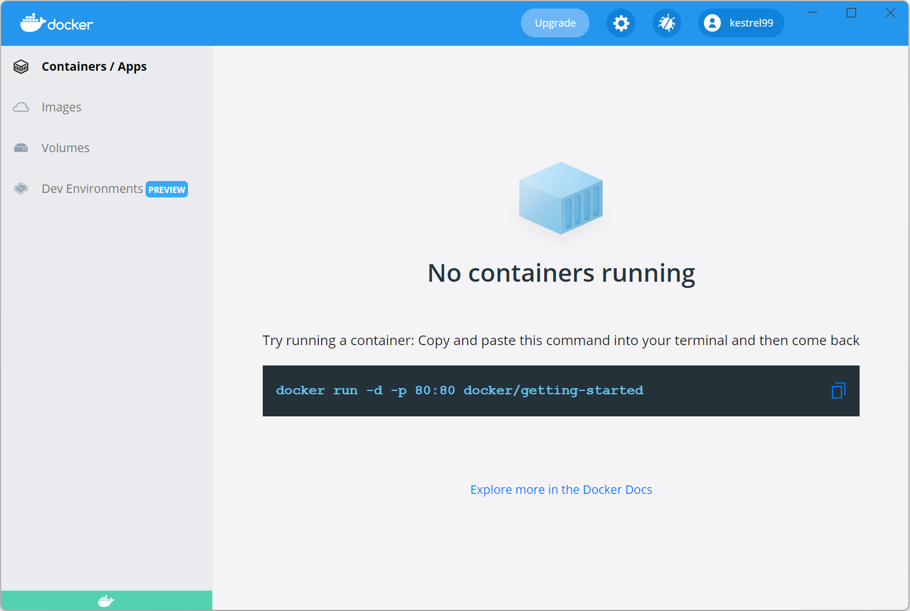
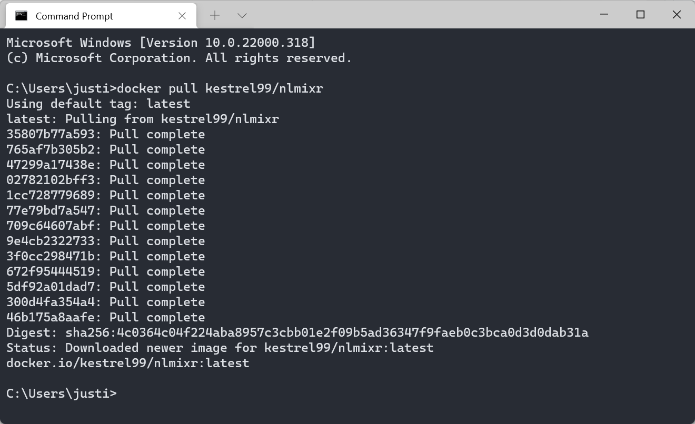

```{r setup, include=FALSE}
knitr::opts_chunk$set(echo = FALSE)
```

## A short introduction

[`nlmixr`](https://nlmixrdevelopment.github.io/nlmixr/) [@Fidler2019] is a free-as-in-beer and open-source tool for fitting nonlinear mixed-effect models in [R](https://www.r-project.org/). It's built on the really quite brilliant [`RxODE`](https://nlmixrdevelopment.github.io/RxODE/) simulation package [@Wang2016], and has no external dependencies that need licensing. It currently contains stable parameter estimation algorithms based on stochastic approximation-estimation maximization (SAEM) [@Delyon1999], first-order conditional estimation with and without interaction (FOCEi and FOCE) as found in [NONMEM](https://www.iconplc.com/innovation/nonmem/), and the venerable `nlme` package developed by Pinheiro and Bates [@Pinheiro2000]. It's a free tool for fitting ODE-based models - you know, the kinds of models that are heavily used in pharmacometrics and econometrics, and that until now have needed software that costs US$100,000 a year to run. 

It's really pretty awesome, all in all.

Installing it, though, has historically been a bit of a bear. It's easier now, since we've managed to get rid of its dependency on Python, but it still has a web of specific R packages it needs, and sometimes the versions of those packages is important. 

Wouldn't it be great if we could just bundle the whole thing up in a sealed bottle that we could easily install without needing to care about those dozens of overlapping, complex interdependencies? Yes. Yes it would. And that's where [Docker](https://www.docker.com/) comes in.

[Wikipedia](https://en.wikipedia.org/wiki/Docker_(software)) describes Docker as a set of "platform as a service" (PaaS) products that use OS-level virtualization to deliver software in packages called containers, which are isolated from one another and bundle their own software, libraries and configuration files. In simple language, Docker provides sealed bottles that we can easily install without needing to care about dozens of overlapping, complex interdependencies.

## Getting started with Docker

Occams is a Windows shop, and so we'll be focusing on getting everything up and running on Windows (11 Pro, in this case). This is pretty easy, assuming you have admin rights - just download and install [Docker Desktop](https://hub.docker.com/editions/community/docker-ce-desktop-windows) based on the comprehensive guide Docker provides. (It can be somewhat fiddly, since virtualization needs to be turned on in your computer's BIOS, and Windows' Virtual Machine Platform and [Windows Subsystem for Linux](https://docs.microsoft.com/en-us/windows/wsl/install) need to be installed - but this is straightforward.) Once you have Docker up and running, you may want to create a user account on Docker and log in, but this isn't required.

```{r, echo = FALSE, fig.align = 'center', out.width = '100%', results = 'markup'} 
  
```

So today we're going to use the [nlmixr Docker image](https://hub.docker.com/r/kestrel99/nlmixr) at Docker Hub. The first thing you'll need to do is open a Windows terminal window and enter the following:

```{bash, eval=F, echo=T}
docker pull kestrel99/nlmixr

```

After a few moments, depending on the speed of your Internet connection, the process will complete.

```{r, echo = FALSE, fig.align = 'center', out.width = '100%', results = 'markup'} 
  
```


