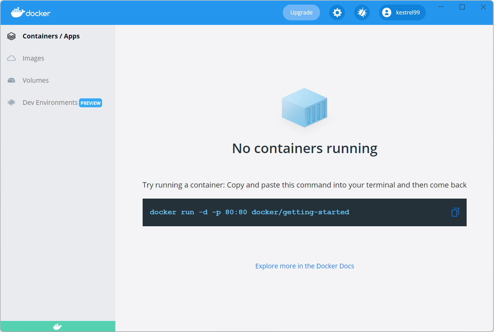

```{r setup, include=FALSE}
knitr::opts_chunk$set(echo = FALSE)
```

## A short introduction

[`nlmixr`](https://nlmixrdevelopment.github.io/nlmixr/) [@Fidler2019] is a free-as-in-beer and open-source tool for fitting nonlinear mixed-effect models in [R](https://www.r-project.org/). It's built on the really quite brilliant [`RxODE`](https://nlmixrdevelopment.github.io/RxODE/) simulation package [@Wang2016], and has no external dependencies that need licensing. It currently contains stable parameter estimation algorithms based on stochastic approximation-estimation maximization (SAEM) [@Delyon1999], first-order conditional estimation with and without interaction (FOCEi and FOCE) as found in [NONMEM](https://www.iconplc.com/innovation/nonmem/), and the venerable `nlme` package developed by Pinheiro and Bates [@Pinheiro2000]. It's a free tool for fitting ODE-based models - you know, the kinds of models that are heavily used in pharmacometrics and econometrics, and that until now have needed software that costs US$100,000 a year to run. 

It's really pretty awesome, all in all.

Installing it, though, has historically been a bit of a bear. It's easier now, since we've managed to get rid of its dependency on Python, but it still has a web of specific R packages it needs, and sometimes the versions of those packages is important. 

Wouldn't it be great if we could just bundle the whole thing up in a sealed bottle that we could easily install without needing to care about those dozens of overlapping, complex interdependencies? Yes. Yes it would. And that's where [Docker](https://www.docker.com/) comes in.

[Wikipedia](https://en.wikipedia.org/wiki/Docker_(software)) describes Docker as a set of "platform as a service" (PaaS) products that use OS-level virtualization to deliver software in packages called containers, which are isolated from one another and bundle their own software, libraries and configuration files. In simple language, Docker provides sealed bottles that we can easily install without needing to care about dozens of overlapping, complex interdependencies.

## Getting started with Docker

[Occams](https://www.occams.com) (where I do my day job as a pharmacometrics consultant) is a Windows shop, and so we'll be focusing on getting everything up and running on Windows (11 Pro, in this case). This is pretty easy, assuming you have admin rights - just download and install [Docker Desktop](https://hub.docker.com/editions/community/docker-ce-desktop-windows) based on the comprehensive guide Docker provides. (It can be somewhat fiddly, since virtualization needs to be turned on in your computer's BIOS, and Windows' Virtual Machine Platform and [Windows Subsystem for Linux](https://docs.microsoft.com/en-us/windows/wsl/install) need to be installed - but this is straightforward.) Once you have Docker up and running, you may want to create a user account on Docker and log in, but this isn't required.

```{r, echo = FALSE, fig.align = 'center', out.width = '100%', results = 'markup'} 
  
```

## Getting the nlmixr container up and running

So today we're going to use the [nlmixr Docker image](https://hub.docker.com/r/kestrel99/nlmixr) at Docker Hub. It's built on the ["verse"](https://hub.docker.com/r/rocker/verse) version of [rocker.org](https://rocker.org)'s excellent series of R containers, and includes [RStudio Server](https://www.rstudio.com/products/rstudio/#rstudio-server), the [tidyverse](https://www.tidyverse.org/) family of packages, [`shiny`](https://shiny.rstudio.com/), a lot of publishing-related software including [TeX](https://www.latex-project.org/), and of course [`nlmixr`](https://nlmixrdevelopment.github.io/nlmixr/), [`RxODE`](https://nlmixrdevelopment.github.io/RxODE/), [`shinyMixR`](https://github.com/RichardHooijmaijers/shinyMixR) and [`xpose.nlmixr`](https://github.com/nlmixrdevelopment/xpose.nlmixr).   

The first thing you'll need to do is open a Windows terminal window and enter the following:

```{bash, eval=F, echo=T}
docker pull kestrel99/nlmixr

```

After a few moments, depending on the speed of your Internet connection, the process will complete.

```{r, echo = FALSE, fig.align = 'center', out.width = '100%', results = 'markup'} 
knitr::include_graphics("../../assets/docker_pull.png")  
```

Looking back at our Docker Dashboard (you can find Docker Dashboard in the Windows taskbar, it's the whale icon), we can see that the `nlmixr` image is now available.

```{r, echo = FALSE, fig.align = 'center', out.width = '100%', results = 'markup'} 
  
```

Drop back to your terminal, and enter: 

```{bash, eval=F, echo=T}
docker container run --rm -it -e PASSWORD=mypass -p 8787:8787 -v /c/MyProject:/home/rstudio/myproject kestrel99/nlmixr
```

This will start the music: the Docker image will be loaded and you'll be able to access the system thanks to the bundled RStudio instance, by pointing your web browser at http://localhost:8787 (this won't happen automatically: if you're staring at a terminal window that says `[services.d] done`, this is your cue to head over to Firefox or Chrome or Edge or Safari (etc). The password will be *mypass*, but you can set this to anything you like at startup. RStudio Server is basically RStudio in a browser - although it's running from our Docker container, in principle it could be running anywhere.  

```{r, echo = FALSE, fig.align = 'center', out.width = '50%', results = 'markup'} 
  
```

Log in with username `rstudio` and the password you set up above. You'll now see RStudio Server in all its glory. You have also mapped the Windows folder **C:/MyProject** to the **myproject** folder within the `nlmixr` Docker image, so you can have access to whatever you need from your local file system. This, as you might imagine, is quite handy, since Docker images are virtual machines and can't otherwise see files that are located outside their bottle universes.

```{r, echo = FALSE, fig.align = 'center', out.width = '100%', results = 'markup'} 
  
```

Have a look in the *Examples* folder to find **examples.R**. There you'll find some code to confirm `nlmixr` is working as it should - run it all and you'll see this: 

```{r, echo = FALSE, fig.align = 'center', out.width = '100%', results = 'markup'} 
  
```

And you've now got a fully-functional Dockerized `nlmixr` development environment running. No mess, no fuss. 

When you're done working in the image, it can be shut down from Docker Desktop - navigate to *Containers/Apps*, and find the image you're running - it'll have a cool random name like *determined-mclaren* as in this example. The just click the stop button. In this example, we're using the `--rm` option, which ensures the instance is deleted after it's closed (the source image will be kept, but anything you've changed will be lost).

```{r, echo = FALSE, fig.align = 'center', out.width = '100%', results = 'markup'} 
  
```

## What next?

Well, the world's your oyster. This short article gives you the tools you need to gets started; Docker has a wealth of options that can be tweaked. For example, you might want to be able to restart the instance you're using at some later point. See the [Docker documentation](https://docs.docker.com/) for more info. 

As for `nlmixr`, check out the [project landing page](https://nlmixrdevelopment.github.io/nlmixr/) for some detailed examples! Remember that `nlmixr` is in constant development, and there may well be bugs. If (when) you find any, report them to the development team at the [GitHub issues page](https://github.com/nlmixrdevelopment/nlmixr/issues) - you'll usually get an answer back within 24 hours. 

If you're not keen on a purely console-based approach, you could do worse than look at Richard Hooijmaaijers' [`shinyMixR`](https://github.com/RichardHooijmaijers/shinyMixR) add-on, which provides a GUI and run manager of sort for `nlmixr`. It comes included! 

