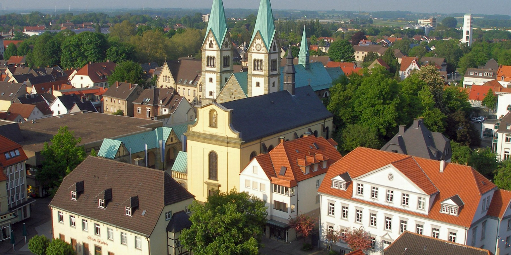

```{r setup, include=FALSE}
knitr::opts_chunk$set(echo = FALSE)

# Learn more about creating blogs with Distill at:
# https://rstudio.github.io/distill/blog.html

```

```{r, echo = FALSE, fig.align = 'center', out.width = '100%', results = 'markup'} 
  
```

Hello, and welcome to Numetrics. 

This is going to be a blog of sorts, and it's going to be focused (mostly) on some of the techier corners of pharmacometrics. What exactly? I don't know. I'm on the development team of [`nlmixr`](https://nlmixrdevelopment.github.io/nlmixr/), so you're going to be hearing about that, I expect, and it's a fair bet there's going to be quite a bit of [R](https://www.r-project.org), and perhaps some [NONMEM](https://www.iconplc.com/innovation/nonmem/) if you're really unlucky. I'm a fan of reproducibility, literate programming, ways to present data, and doing things more efficiently. So, a bit of tech, and a bit of gloss. Possibly a bit about pharmacometrics in general.

Posts are going to be irregular. As I write this, we're still neck deep in the global COVID-19 pandemic, and I'm a consultant, so I'm pretty much permanently slammed. But hey, stay tuned! 

(In case you were wondering, the picture is an aerial view of the teeming metropolis of Werl, Germany, home since January 2019. It's an old [Hanseatic League](https://en.wikipedia.org/wiki/Hanseatic_League) city with a charming *Wallfahrtsbasilika*, which was and still is popular with pilgrims, and a stop on the [Hellweg](https://en.wikipedia.org/wiki/Hellweg). We like it.)


